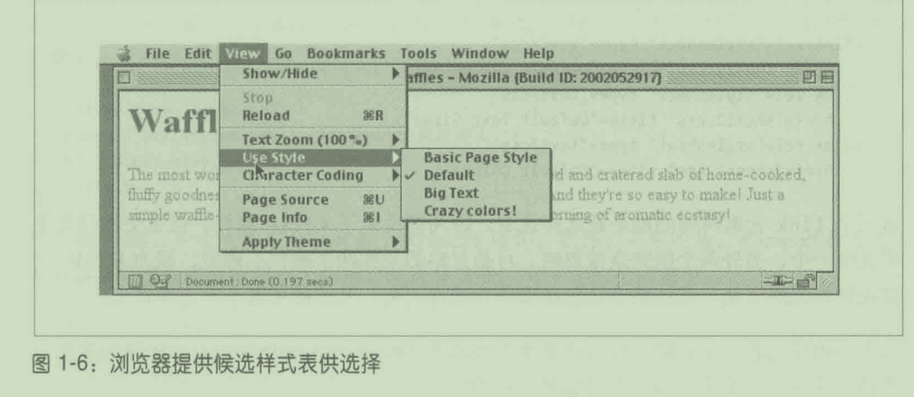

# 第 1 章 CSS和文档

## 1.1 Web样式简介

## 1.2 元素

### 1.2.1置换元素和非置换元素

#### 置换元素

- 置换元素(replaced element)
  - 用来置换元素内容的部分
    - 不由文档内容直接表示。
- 在HTML 中，最常见的置换元素img，
  - 它的内容由文档之外的图像文件替换。
  - img元素没有内容:

```

```

- 如果指向的图像文件存在
  - 文档会把那个图像显示出来;
  - 否则,
    - 浏览器什么也不显示,
    - 或者显示“图像损坏”占位图。
- input元素，
  - 根据类型的不同，会替换成
    - 单选按钮、
    - 复选框
    - 文本输入框。

#### 非置换元素

- HTML元素大部分是非置换元素（nonreplaced element)
  - 元素的内容
    - 由用户代理(浏览器）在元素自身生成的框中显示。
- \<span>hi there\</span>是非置换元素，
  - 用户代理会显示“hi there”文本。
- 段落、标题、单元格、列表
  - 以及 HTML 中其他几乎所有元素都是非置换元素。

### 1.2.2元素的显示方式

#### 块级元素

- 块级元素（默认)生成一个填满父级元素内容区域的框，
  - 旁边不能有其他元素。
- HTML 中最常见的块级元素是
  - p
  - div。
- 置换元素可以是块级元素,
  - 但往往不是。
- 列表项目是一种特殊的块级元素，
  - 会在元素框旁生成一个记号
    - 无序列表通常是圆点，
    - 有序列表通常是数字

#### 行内元素

- 行内元素在一行文本内生成元素框，
  - 不打断所在的行。
- 最常见的行内元素是
  - a
  - strong
  - em
- 行内元素可以出现在另一个元素的内容中,
  - 且不影响所在的元素。
- 块级元素和行内元素区别:
  - 块级元素不能出现在行内元素中。
    - 但CSS相互之间可以嵌套。

- CSS 属性display


- 只关注block和inline。来看下述标记:

```
<body>
  <p>This is a paragraph with <em>an inline element</em> within it.</p>
</body>

```

- 两个块级元素(body和p)
  - 一个行内元素(em）。
- em可以放在 p里，
  - 而反过来却不行。
- CSS 没有这种限制。
  - 可以改变它们的显示方式:

```
p {
    display: inline;
}

em {
    display: block;
}
```

- 行内框中出现一个块级框。
  - 不违背任何CSS规则。
- 如果在HTML中调换元素之间的嵌套关系,就会出问题:

```
<em>
  <p>This is a paragraph improperly enclosed by an inline element.</p>
</em>

```


## 1.3把 CSS 应用到HTML 上

### 1.3.1 link标签

```
<link rel="stylesheet" type="text/css" href="sheet1.css" media="all" />

```

- CSS使用link标签
  - 链接应用到文档上的样式表。

- 外部样式表(external stylesheet)，
  - 通过 link标签链接的样式表

- link标签必须放在head元素中，
  - 不能放在其他元素中。
- @import声明必须放在所在样式表的开头

- 外部样式表中包含
  - 是一系列规则
  - 不能有HTML 或其他标记语言

- 外部样式表
  - 保存为纯文本文件，
  - 扩展名通常是.css，
    - 例如sheetl.css。

- 文件扩展名不是必须的,
- 如果文件名不以.css结尾，
  - 有些旧的浏览器不会将其识别为包含样式表的文件。

#### 属性

- rel是“relation”（关系)的简称,
  - 这里指定的关系是stylesheet。
- type属性的值始终为text/css，
  - 说明通过 link标签加载的数据类型。
  - 这样 Web浏览器才知道加载的样式表是CSS样式表
- href属性,它的值是样式表的 URL，
  - 可以是绝对地址，
  - 也可以是相对地址,

- media属性,
  - 它的值是一个或多个媒体描述符(media descriptor)，
    - 指明媒体的类型和具有的功能。
  - 多个媒体描述符以逗号分开。
- 链接针对屏幕媒体和投影媒体的样式表:

```
<link
  rel="stylesheet"
  type="text/css"
  href="visual-sheet.css"
  media="screen, projection"
/>

```

- 一个文档可以关联多个样式表
- 如果想链接两个分别名为basic.Css和 splash.css的样式表

```
<link rel="stylesheet" href="basic.css" type="text/css">

<link rel="stylesheet" href="splash.css" type="text/css">
```

- 浏览器会加载指定的两个样式表，
  - 合并样式规则后
  - 再应用到文档上。

#### 候选样式表

- 候选样式表（alternate stylesheet)，
  - 把rel属性的值设为alternate stylesheet。
- 仅当用户自己选择，
  - 文档才会使用候选样式表渲染。
- 使用link元素title属性的值
  - 生成候选样式列表。

```
<link rel="stylesheet" type="text/css" href="basic.css" title="Default" />

<link
  rel="alternate stylesheet"
  type="text/css"
  href="splash.css"
  title="Big Text"
/>

<link
  rel="alternate stylesheet"
  type="text/css"
  href="zany.css"
  title="Crazy colors!"
/>

```

- 浏览器默认使用第一个样式表
  - 还可以自行选择想使用的样式表。



- 为不同的候选样式表设定相同的title值，
  - 把它们分组放在一起。
- 用户可以为屏幕和印刷媒体选择不同的外观。

```
<link
  rel="stylesheet"
  type="text/css"
  href="basic.css"
  title="Default"
  media="screen"
/>
<link
  rel="stylesheet"
  type="text/css"
  href="basic.css"
  title="Default"
  media="print"
/>
<link
  rel="alternate stylesheet"
  type="text/css"
  href="bigText.css"
  title="Big Text"
  media="screen"
/>
<link
  rel="alternate stylesheet"
  type="text/css"
  href="print-bigText.css"
  title="Big Text"
  media="print"
/>

```

- 如果用户选择“Big Text”，
  - 屏幕媒体将使用bigtext.css装饰文档,
  - 印刷媒体将使用print-bigtext.css，
  - 任何媒体都不会使用sheetl.css或 print-sheet1.css 。

- 首选样式表(preferred stylesheet)。
  - 属性为rel的stylesheet 的 link元素
    - 设定标题，
- 首选样式表优先于候选样式表,
  - 显示文档时默认使用。
- 选择候选样式表之后,
  - 首选样式表就不使用了。

- 如果有一组首选样式表,
  - 那么只会使用其中一个,

```
<link
  rel="stylesheet"
  type="text/css"
  href="sheet1.css"
  title="Default Layout"
/>
<link
  rel="stylesheet"
  type="text/css"
  href="sheet2.css"
  title="Default Text Sizes"
/>
<link
  rel="stylesheet"
  type="text/css"
  href="sheet3.css"
  title="Default Colors"
/>

```

- 这三个link元素都设定了title属性
  - 都是首选样式表，
  - 但是文档只会使用其中一个
  - 无法确定该使用哪个首选样式表

- 如果不为样式表设定标题，
  - 那它就是永久样式表(persistent stylesheet)，
  - 始终用于显示文档。

### 1.3.2 style元素

- style元素是一种引入样式表的方式
  - 直接写在文档中

```
<style type="text/css">...</style>
```

- style元素应该始终设定type 属性。
  - 正确的值是"text/css",

- style元素也有 media 属性，
  - 与ink元素一样

- 开始和结束style标签之间的样式称为
  - 文档样式表(document stylesheet)
  - 嵌入式样式表（embedded stylesheet
- style元素
  - 可以直接包含样式,
  - 也可以通过@import指令引入外部样式表。

### 1.3.3 @import 指令

```
@import url(sheet2.css);
```

- 浏览器遇到@import 指令时
  - 会加载外部样式表，
  - 使用其中的样式渲染 HTML 文档。
- @import指令在style元素内部，
  - 必须放在其他CSS规则前面，

```
<style type="text/css">
    @import url(styles.css); /*@import放在开头*/
    h1 {
        color: gray;
    }
</style>
```

- 一个文档中可以有多个@import语句
- @import 指令导入的每个样式表都会使用
  - 无法指定候选样式表

```
@import url(sheet2.css);
@import url(blueworld.css);
@import url(zany.css);
```

- @import指令可以显示导入的样式表应用于何种媒体。
  - 在样式表的URL后面提供媒体描述符:

```
@import url(sheet2.css) all;
@import url(blueworld.css) screen;
@import url(zany.css) projection, print;
```

- 如果一个外部样式表需要用到另一个外部样式表中的样式，
  - @import指令
- 外部样式表
  - 不能包含任何文档标记，
  - 可以使用@import指令。
- @import 指令必须在所有样式规则前面

### 1.3.4 HTTP链接

- 为文档关联 CSS
  - 使用HTTP首部

### 1.3.5行内样式

- HTML元素的style属性
  - 设置行内样式

- 除了body元素之外的标签
  - 所有HTML标签都能设定style属性

- \<p style="color: maroon; background:yellow;" >

- ,style属性的值
  - 只能是一系列规则声明，
    - 样式规则花括号之间的那一部分。
  - 不能包含整个样式表
    - 不能在style属性中使用@import 指令

- 通常不建议使用style属性。
  - 集中管理样式，
    - 控制整个文档或网站中所有文档的外观。

## 1.4样式表中的内容

### 1.4.1标记

- 样式表中不能有标记
- style元素中可以有HTML注释。

### 1.4.2规则的结构

- 一个规则由两个基本部分构成:
  - 选择符(selector)
  - 声明块（declaration block)。
- 声明块由一个或多个声明组成,
  - 一个声明包含
    - 一个属性(property)
    - 对应的值（value)。
- 一个样式表由一系列规则构成。


### 1.4.3厂商前缀


### 1.4.4处理空白

- CSS对待空白的方式
  - 连续的空白会合并成一个空白。

- 多个关键字必须使用空白分开。

### 1.4.5 CSS 注释

```
/* 这是一个css注释 */
```

```
/* 这是一个css注释 
可以分成多行*/
```

- CSS 注释不能嵌套。
  - “外层”注释会在“内层”注释的结束处结束。

- 注释可以放在
  - 规则内部，
  - 声明内部。

## 1.5媒体查询

### 1.5.1用法

- 媒体查询可以在下述几个地方使用:
  - link元素的media属性。
  - style元素的media属性。
  - @import声明的媒体描述符部分。
  - @media 声明的媒体描述符部分。

- 媒体查询可以是
  - 简单的媒体类型,
  - 复杂的媒体类型和特性的组合。

### 1.5.2简单的媒体查询

- 一个样式表中可以有多个@media块,
  - 而且每个都有自己的一套媒体描述符

```
h1 {color:maroon;}

@media projection {
    body {background:yellow;}
}
```

- 在所有媒体中，h1元素的颜色都是红褐色，
  - 在投影媒体中body元素会有一个黄色背景。

### 1.5.3媒体类型

- 媒体查询最基本的形式媒体类型
- 媒体类型就是指明不同媒体的标注:
  - all
    - 用于所有展示媒体。
  - print
    - 打印文档时使用,
    - 也在预览打印效果时使用。
  - screen
    - 在屏幕媒体上展示文档时使用。
      - 浏览器都是屏幕媒体用户代理。

- 多个媒体类型
  - 使用逗号分隔罗列。
- 下面四种方式都能把一个样式表(或一个规则块)
  - 同时应用到屏幕媒体和印刷媒体上:

```
<link type="text/css" href="frobozz.css" media="screen, print">
<style type="text/css" media="screen, print"></style>

@import url(frobozz.css) screen, print;

@media screen, print {...}
```

### 1.5.4媒体描述符

- 下面两种方式都
  - 能把指定的外部样式表应用到彩打上:

```
<link
  href="print-color.css"
  type="text/css"
  media="print and (color)"
  rel="stylesheet"
/>

@import url(print-color.css) print and (color);

```

- 能使用媒体类型的地方
  - 都能使用媒体查询。
- 可以通过一个逗号分隔的列表列出多个查询:

```
<link
  href="print-color.css"
  type="text/css"
  media="print and (color), screen and (color-depth:8)"
  rel="stylesheet"
/>

@import url(print-color.css) print and (color), screen and (color-depth:8);

```

- 只要其中一个媒体查询的条件得到满足，
  - 就会应用指定的样式表。
- 使用彩色打印机打印文档，
  - 或者在色深足够的环境中渲染文档时
  - 会使用print-color.css。
- 如果使用的是黑白打印机，
  - 两个查询的条件都不满足，
  - 因此 print-color.css不会应用到文档上。
  - 在屏幕等媒体中渲染文档时也是如此。

- 一个媒体描述符包含
  - 一个媒体类型
  - 一个或多个媒体特性列表，
    - 特性描述符要放在圆括号中。
- 如果没有媒体类型,
  - 那就应用到所有媒体上，
- 因此下面两个示例是等效的:

```
@media all and (min-resolution: 96dpi) {}

@media (min-resolution: 96dpi) {}
```

- 媒体特性描述符的格式
  - 类似于CSS中的一对属性和值。
- 二者之间最大的区别是，
  - 特性描述符可以不指定值。
- 任何彩色媒体
  - 都符合(color）指定的条件，
- 任何色深为16位的彩色媒体
  - 都符合（color: 16）指定的条件。
- 不指定值时是在做判断。
  - (color)的意思是“这个媒体是彩色的吗?”

- 多个特性描述符
  - 使用逻辑关键字and连接。
- 媒体查询中可使用的逻辑关键字有两个:
  - and
    - 连接的两个或多个媒体特性必须同时满足条件，
      - 整个查询得到的结果才是真值。
  - not
    - 对整个查询取反。
    - 假如所有条件都为真，
      - 那样式表不会应用到文档上。
    - 除此之外的情况应用到文档

- not关键字只能在媒体查询的开头使用。
  - 写为这样是无效的:
    - (color) and not(min-device-width: 800px)
- 太旧的浏览器不支持媒体查询，
  - 因此会跳过媒体描述符以not 开头的样式表。

- 媒体设备不支持OR关键字
  - 分隔多个媒体查询的逗号相当于OR。

- only关键词，
  - 专门用于保证向后兼容

- only
  - 在不支持媒体查询的旧浏览器中隐藏样式表。

- 如果想在所有媒体中应用一个样式表，
  - 但是只在支持媒体查询的浏览器中应用，

```
@import url(new.css) only all
```

- 在支持媒体查询的浏览器中，
  - only 关键字被忽略，
  - 样式表会应用到文档上。
- 在不支持媒体查询的浏览器中，
  - 媒体类型为only all，
    - 这是无效的,
  - 因此不会应用样式表。
- only关键字只能用在媒体查询的开头。

### 1.5.5媒体特性描述符和值的类型

- 媒体特性描述符：


- 两种新增的值:
  - \<ratio>
  - \<resolution>

## 1.6特性查询

- 根据用户代理是否支持特定的CSS属性及其值
  - 来应用一段样式。
  - 这个功能称为特性查询（feature query)。
- 想在用户代理支持color属性时
  - 为元素设定颜色,

```
@supports (color: black) {
    body {
        color: black;
    }

    h1 {
        color: purple;
    }

    h2 {
        color: navy;
    }
}
```

- “如果你能识别并处理color: black这样的属性和值组合，
  - 那就应用这段样式;
  - 否则，跳过这段样式。
- ”如果用户代理不支持@supports，
  - 整段样式都会跳过。

- 特性查询是渐进增强样式的完美方式。
- 想在浮动布局之外增加栅格布局，
  - 保留现有的布局方式,
  - 添加下面这段样式

```
@supports (display: grid) {
    section#main {
        display: grid;
    }

    /* 去掉旧布局的样式 */
    /* 栅格布局的样式 */
}
```

- 这段样式在支持栅格布局的浏览器中应用，
  - 它会覆盖旧的页面布局，
  - 然后应用通过栅格实现的新布局。

- 特性查询可以嵌套,
  - 还可以嵌套在媒体查询中，
  - 反过来嵌套也可以。
- 若想使用弹性盒布局编写针对屏幕和印刷媒体的样式，
  - 可以把媒体查询块放在
    - @supports(display: flex)块里:

```
@supports (display: flex) {
    @media screen {
        /* 针对屏幕媒体的弹性盒样式 */
    }

    @media print {
        /* 针对印刷媒体的弹性盒样式 */
    }
}
```

- 可以在媒体查询块中添加@supports()块:

```
@media screen and (max-width: 30em) {
    @supports (display: flex) {
        /* 针对小屏的弹性盒样式 */
    }
}

@media screen and (min-width: 30em) {
    @supports (display: flex) {
        /* 针对大屏的弹性盒样式 */
    }
}
```

- 特性查询也支持使用逻辑运算符。
- 假如想在用户代理同时支持栅格布局和CSS形状时
  - 应用一段样式

```
@supports (display: grid) and (shape-outside: circle()) {
    /* 栅格和形状样式 */
}
```

- 这与下述写法是等效的:

```
@supports (display: grid) {
    @supports (shape-outside: circle()) {
        /* 栅格和形状样式 */
    }
}
```

- WebKit 只支持通过带厂商前缀的属性绘制形状。
  - 如果想绘制形状,
    - 可以使用这样的特性查询:

```
@supports (shape-outside: circle()) or (-webkit-shape-outside: circle()) {
    /* 绘制形状的样式 */
}
```

- 带厂商前缀的形状属性和不带厂商前缀的形状属性
  - 最好同时使用，
- 上例这样做既能兼容 WebKit 以后的版本，
  - 也能支持其他无需使用厂商前缀的浏览器。
- 想在支持栅格时修改布局元素的外边距等。
  - 下面是简化的版本:

```
div#main {
    overflow: hidden;
}

div.column {
    float: left;
    margin-right: 1em;
}

div.column:last-child {
    margin-right: 0;
}

@supports (display: grid) {
    div#main {
        display: grid;
        grid-gap: 1em 0;
        overflow: visible;
    }

    div#main div.column {
        margin: 0;
    }
}
```

- 使用取反运算符
  - 在不支持栅格布局时应用:

```
@supports not (display: grid) {
    /* 不支持栅格时使用的样式 */
}
```

- 一个特性查询中可以使用多个逻辑运算符，
  - 但是为了保证条理清晰，要使用括号。
- 假如我们想在支持颜色的同时
  - 还支持栅格或弹性盒布局中的一个时

```
@supports (color: black) and ((display: flex) or (display: grid)) {
    /* 相关的样式 */
}
```

- 判断支持栅格或弹性盒的查询
  - 放在一对括号里。
  - 不要写成这样:

```
@supports (color: black) and (display: flex) or (display: grid) {
    /* 相关的样式 */
}
```

- 为什么特性查询的测试中既要写属性也要写值。
  - 因为浏览器可能支持某个属性，
    - 但不支持它的全部取值。
  - 如果像下面这样测试是否支持栅格肯定是不行的:

```
@supports (display) {
    /* 栅格样式 */
}
```

## 1.7小结

- CSS可以完全改变元素在用户代理中的表现方式。
  - 可能只使用display属性,
  - 可以为文档关联样式表。
- 外部样式表的主要优势是，
  - 可以把一个网站的所有表现信息放在一个地方，
    - 然后在所有文档中指向这个位置。
  - 这样不仅便于更新和维护网站，
  - 还能节省带宽,
    - 因为所有表现都游离在文档之外。
- 借助@suppoorts()
  - 可以使用纯CSS实现基本的渐进增强功能。

