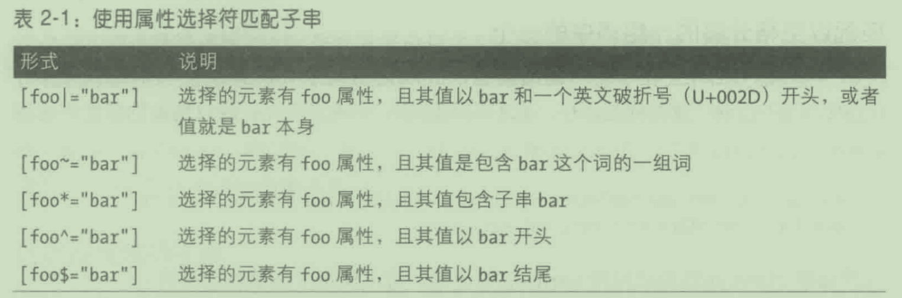

# 第 2 章 选择符

## 2.1样式的基本规则

### 2.1.1元素选择符

- 元素选择符(element selector)
  - 通常是 HTML元素

- 为 HTML 文档编写样式时，
  - 选择符一般是 HTML 预定义的某个元素，
  - 例如p、 h3、em、a，甚至是html自身。

```
html {color: black;}
h1 {color: gray;}
h2 {color: silver;}
```

- 直接为元素定义全局样式后，
  - 可以把样式从一个元素身上移到另一个元素身上。
- 假如我们想让段落显示为灰色，而不是h1元素
  - 只需把h1选择符改为p:

```
html {
    color: black;
}

p {
    color: gray;
}

h2 {
    color: silver;
}
```

### 2.1.2声明和关键字

- 声明块中
  - 有一个或多个声明。
- 声明的格式是固定的,
  - 先是属性，
  - 然后是冒号，
  - 后面再跟上值和分号。
- 冒号和分号后面可以有
  - 零个或多个空白。
- 值几乎都是
  - 一个关键字
  - 或以空格分隔的多个关键字。
- 如果声明中的属性或值有误，
  - 整个规则都将被忽略。
- 因此，下面两个声明是无效的:

```
brain-size: 2cm; /* 未知属性"brain-size" */
color: ultraviolet; /* 未知值 "ultraviolet" */
```

- 如果属性的值可以是多个关键字，
  - 关键字之间通常以空格分隔，
  - 有时则使用斜线()或逗号。
- 假如想让段落中的文本
  - 使用Helvetica字体，
  - 并把字号设为中等

```
p {
    font: medium Helvetica;
}
```

- 分号表示声明结束。
- 这些以空格分开的词称为关键字
- 在 CSS2.1中，有个特例:
  - font属性的值有一处要使用斜线(/)把两个关键字隔开

```
hr {
    font: large/150% sans-serif;
}
```

- 这个斜线把设定元素字号和行高的两个关键字分开。
- font声明只有这一个地方允许出现斜线,
  - 其他关键字都以空格分隔。
- 其他一些属性的值中也可以使用斜线，比如说（不完整):


- 还有一些关键字以逗号分隔。

```
.box {
    box-shadow: inset -1px -1px white,
        3px 3px 3px rgba(0, 0, 0, 0.2);
    background-image: url(myimage.png),
        linear-gradient(180deg, #FFF 0%, #000 100%);
    transform: translate(100px, 200px);
}

a:hover {
    transition: color, background-color 200ms ease-in 50ms;
}
```

## 2.2群组

### 2.2.1群组选择符

- 假如想让h2元素和段落中的文本都显示为灰色,

```
h2, p {
    color: gray;
}
```

- 逗号告诉浏览器，
  - 这个规则涉及两个不同的选择符。
- 可以放在一起的选择符数量
  - 没有限制。

#### 通用选择符

- 通用选择符（universal selector)，
  - 写作星号(*)。
- 这个选择符匹配
  - 所有元素

- 通用选择符的
  - 特指度是0-0-0

### 2.2.2群组声明

- 一个规则
  - 可以有多个选择符，
  - 也可以有多个声明。
- 如果想让所有h1元素的
  - 颜色为紫色,
  - 字体为Helvetica,字号为18像素，
  - 背景为浅绿色

```
h1 {
    font: 18px Helvetica;
    color: purple;
    background-color: aqua;
}
```

- 多个声明写在一起时，
  - 千万别忘了结尾的分号

### 2.2.3二者结合

```
h1, h2, h3 {
    font: 18px Helvetica;
    color: purple;
    background-color: aqua;
}
```

### 2.2.4在旧浏览器中使用新元素

- 解决方法是在DOM 中创建元素，
  - 让浏览器知道元素的存在

```
document.createElement('main');
```

## 2.3类选择符和ID选择符

### 2.3.1类选择符

- 让类选择符起作用。
  - 设定class属性:

- 选择类的句法是
  - 在class属性的值前面加上点号(.)

- 使用ID选择符、类选择符、属性选择符、伪类选择符或伪元素选择符时，
  - 如果没有依附元素选择符,
    - 隐式蕴含通用选择符（使用*符号表示)。

```
p.warning {
    font-weight: bold;
}
```

### 2.3.2多个类

- class属性的值可以是多个词,
  - 词之间使用空格分隔。
  - 词的顺序无关紧要

```
<p class="urgent warning"></p>
```

- 假如你想让class属性的
  - 值为 warning的元素显示为粗体
  - 值为urgent的元素显示为斜体,
  - 而同时拥有二者的元素具有银色背景，

```
.waring {
    font-weight: bold;
}

.urgent {
    font-size: italic;
}

.waring .urgent {
    background: silver;
}
```

### 2.3.3 ID选择符

- ID 选择符的开头是个散列字元（#)，

- 每个文档中都有这么一个 ID，
  - 依附的元素不定，
  - 而且出现的次数不会超过一个

### 2.3.4在类选择符和ID选择符之间选择

- ID选择符不能串在一起使用，
  - 因为ID 属性的值不能是以空格分隔的列表。

- ID选择符的权重更高

- 类和ID的值是区分大小写的，

## 2.4属性选择符

### 2.4.1简单属性选择符

- 如果想选择具有某个属性的元素,
  - 可以使用简单属性选择符。

- 若想选择具有class属性的所有h1元素

```
h1[class] {
    color: silver;
}
```

- 如果想选择具有title属性的元素

```
*[title] {
    font-weight: bold;
}
```

- 还可以基于多个属性选择。
  - 要把多个属性选择符串在一起。
- 想选择同时具有href 和title属性的HTML 超链接

```
a[href][title] {
    font-weight: normal;
}
```

### 2.4.2根据精准的属性值选择

- 只选择属性为特定值的元素
- 想选择指向Web服务器上某个文档的超链接

```
a[href="http://www.css.html"] {
    font-weight: bold;
}
```

- 可以把多个属性和值选择符串在一起。
- 若想选择 href属性的值为http://www.w3.org/，
  - 而且title属性的值为W3C Home 的 HTML 超链接

```
a[href="http://www.w3.org/"][title="w3c Home"] {
    font-weight: bold;
}
```

- ID选择符与引用id属性的属性选择符不完全等效。
  - h1#page-title
  -  h1[id="page-title"]

### 2.4.3根据部分属性值选择



#### 一种特别的属性选择符

```
*[lang|="en"] {
    color: white;
}
```

- 这个规则选择lang属性的
  - 值为en
  - 或者以en-开头的元素。

#### 匹配以空格分隔的一组词中的一个

- 选择符中有个波浪号(~)。
  - 根据一组以空格分隔的词中是否有某个词选择

- p.warning和 p[class~= "warning"]是等效的

- 除了class属性之外
  - 还可以根据其他属性选择。
- 一个文档中可能有多个图像，但只有部分是插图。
  - 可以在 title属性上使用匹配部分值的选择符,
    - 只选择插图:

```
img[title~="Figure"] {
    border: 1px solid gray;
}
```

#### 匹配属性值的子串

- 想根据部分属性值选择元素，
  - 可以使用[att*="val"]形式
    - 匹配出现在属性值内部任何位置的子串。
- 假设你想特别显示指向O'Reilly 网站的链接。

```
a[href*="oreilly.com"] {
    font-weight: bold;
}
```

- 这种选择符并不局限于class和 href属性，
  - 任何属性都可以，
  - 例如title、alt、src、id

- 模式类的类名经常使用子串属性选择符匹配一系列类。
- 我们可以选择类名以“btn”和一个英文破折号开头的元素
  - 以及包含一个英文破折号后跟子串“arrow”的元素:

```
*[class|="btn"][class*="-arrow"]:after {
    content: "@"
}

```

```
<button class="btn-small-arrow-active">Click Me</button>

```

-  HTML属性值中的关键字，
  - 不区分大小写;
    - 例如输入框的类型

```
<input type="checkbox" name="rightmargin" value="10px" />

```

```
input[type="CHECKBoX"] {
    margin-right: 10px;
}
```

#### 匹配属性值开头的子串

- 如果想根据属性值开头的子串选择元素，
  - [att^="val"]形式的属性选择符。
- 如果想以不同方式显示不同类型的链接

```
a[href^="https:"] {
    font-weight: bold;
}

a[href^="mailto:"] {
    font-style: italic;
}
```

- 装饰文章中用作插图的图像
  - 假设插图的alt属性值都是“Figure 5”这种形式

```
img[alt^="Figure"] {
    border: 2px solid gray;
    display: block;
    margin: 2em auto;
}
```

- 使用这种选择符选择日程表中排在周一做的事。
- 假设所有事件都有title属性，
  - 而且其值的格式是“Monday,March 5th, 2012”。
    - 可以使用[title^="Monday"]选择这些事件。

#### 匹配属性值结尾的子串

- 匹配结尾的子串，
  - 这种选择符的形式为[att$="val"]。
- 根据目标资源的类型
  - 装饰链接，
- 以独特的方式装饰PDF 文档

```
a[href$=".pdf"] {
    font-weight: bold;
}
```

- 根据图像的格式选择图像

```
img[src$=".gif"] {}
img[src$=".jpg"] {}
img[src$=".png"] {}
```

- 可以使用类似[title$="2015"]的选择符
  - 选择某一年内发生的事件。

- 属性选择符中的属性值
  - 都放在引号内。
- 使用引号是为了
  - 把无效的标识符变成有效的值，

### 2.4.4不区分大小写的标识符

- 属性选择符不区分大小写的选项
  - 在结束方括号前加上i

```
a[href$='.PDF'i]
```

- 它只针对属性选择符中的值,
  - 不涉及属性的名称。

## 2.5根据文档结构选择

### 2.5.1理解父子关系

- “父元素”和“子元素”
  - 是“祖辈元素”和“后代元素”的特例。
- 在树状视图，
  - 如果两个元素所在的层级是连续的，
    - 它们之间是父子关系;
  - 如果两个元素之间跨两个层级以上，
    - 它们之间是祖辈和后代的关系,

### 2.5.2后代选择符

- 后代选择符（descendant selector，
  - 也叫上下文选择符，contextual selector)。

```
h1 em {
    color: gray;
}
```

- 规则中的选择符由
  - 两个或多个空格分隔的选择符构成。
- 选择符之间的空格是一种连结符。
- h1 em可以理解为
  - “作为h1元素后代的em元素”

- 两个元素之间的层级间隔可以是无限的。

### 2.5.3选择子元素

```
h1 > strong {
    color: red;
}
```

- “选择的strong元素是h1元素的直接子代”。

### 2.5.4选择紧邻同胞元素

```
h1 + p {
    margin-top: 0;
}
```

- “选择的p元素紧跟在h1元素后面，
  - 而且二者同属一个父元素”。

### 2.5.5选择后续同胞

```
h2 ~ ol {
    font-style: italic;
}
```

- 想选择h2后面与它同属一个父元素的ol元素
  - 可以编写h2 ~ol{font-style: italic;}。
    - 两个元素不一定是紧邻同胞,

## 2.6伪类选择符

### 2.6.1拼接伪类

- CSS允许把伪类拼接（串联)在一起。
- 可以把有鼠标悬停其上的未访问链接显示为红色，
  - 把有鼠标悬停其上的已访问链接显示为红褐色:

```
a:link:hover {
    color: red;
}
a:visited:hover {
    color: maroon;
}
```

- 拼接伪类的顺序不重要
- 别拼接相互排斥的伪类
  - 链接不可能既已访问又未访问,

### 2.6.2结构伪类

#### 选择根元素

- :root 伪类选择文档的根元素。

- 在HTML中,根元素始终是html

#### 选择空元素

- 使用:empty伪类可以选择没有任何子代的元素,
  - 甚至连文本节点都没有

- :empty还能匹配里面没有内容的textarea。
- 就匹配元素的效果而言，img和 img:empty其实是一样的

- :empty是唯一一个在匹配时考虑文本节点的CSS 选择符。
  - 其他选择符都只考虑元素,完全忽略文本节点。

#### 选择唯一的子代

- :only-child 伪类选择的元素是
  - 另一个元素的唯一子元素。
- 假设你想为作为另一个元素唯一子元素的图像加上边框

```
img:only-child {
    border: 1px solid black;
}
```

- 如果一个段落中只有一个图像，没有其他子元素，
  - 那个图像就会独立于周围的文本被选中。
- 有两点要注意。
  - 唯一子元素的那个元素上
  - 在后代选择符上使用:only-child伪类时，
    - 列出的元素不一定是父子关系。

- a[href] img:only-child匹配的图像是唯一的子元素,
  - 而且是 a元素的后代，
  - 而不是a元素的子元素。
- 匹配时，那个元素必须是
  - 其直接父元素的唯一子元素,
    - 而且是链接的后代，
  - 图像的父元素自身也可以是链接的后代。
- 下面三个图像都能匹配

```
a[href] img:only-child {
    border: 5px solid black;
}

```

```
<a href="#">
  
</a>

<a href="#">
  <span>
    
  </span>
</a>

<a href="#">
  A link to
  <span>
    the
    
    web
  </span>
  site
</a>

```

- :only-of-type 匹配同胞中唯一的那种元素,
  - :only-child只匹配完全没有同胞的元素。

- 使用:only-of-type可以选择段落中的图像,

```
p > img:only-of-type {
    float: right;
    margin: 20px;
}
```

- :only-of-type指代的是元素,

```
p.unique:only-of-type {
    color: red;
}
```

```
<div>
    <p class="unique">This paragraph </p>
    <p>this paragraph</p>
</div>
```

- 两个段落都不会被选中。
  - 因为两个段落都是div的后代,
  - 因此不可能是唯一一个段落类型

#### 选择第一个和最后一个子代

```
p:first-child {
    font-weight: bold;
}

li:first-child {
    text-transform: uppercase;
}
```

- 第一个规则选择一个元素中的第一个p元素
- 第二个规则选择一个元素中的第一个li元素

- 这两个伪类结合在一起的效果相当于:only-child。

```
p:only-child {
    color: red;
}

p:first-child:last-child {
    background-color: red;
}
```

#### 选择第一个和最后一个某种元素

```
table:first-of-type {
    border-top: 2px solid gray;
}
```

- 选择里面有表格的元素中
  - 的第一个 table,


- :last-of-type从同胞元素中选择指定种类元素的最后一个


#### 选择每第n个子元素

- :nth-child()伪类。
  - 可以在括号中填上整数，简单的代数式

- 与:first-child 等效的:nth-child(1)。

```
p:nth-child(1) {
    font-weight: bold;
}
li:nth-child(1) {
    text-transform: uppercase;
}
```

#### 选择每第n个某种元素

```
p>a:nth-of-type(even) {
    background: blue;
    color: white;
}
```

### 2.6.3 动态伪类

#### 超链接伪类


#### 用户操作伪类


#### 动态样式引起的问题

- 鼠标指针悬停在那个锚记上时，
  - 用户代理增大了它的字号
- 在锚记处于悬停状态时必须重新绘制文档，
  - 导致那个链接后面的内容重排

### 2.6.4 UI状态伪类


- 虽然UI元素的状态能被用户操作改变，
  - 但是UI状态伪类不是单纯动态的,
  - 因为它们还受文档结构或DOM 脚本的影响。

#### 启用和禁用的UI元素

- 若想把元素设为禁用的，
  - 可以使用DOM 脚本，
  - 也可以在 HTML5元素的标记中添加disabled 属性。

- 这两个状态可以使用:enabled和:disabled 伪类装饰。

```
:enabled {
    font-weight: bold;
}
:disabled {
    opacity: 0.5;
}
```

#### 选择状态

- :checked伪类
- indeterminate伪类，
  - 它匹配的UI元素是未选中

```
:check {
    background: silver;
}
:indeterminate {
    border: red;
}
```

#### 默认选项伪类

- :default 伪类匹配
  - 一组相似元素中取默认值的UI元素。
- 这个伪类通常用于上下文菜单选项、按钮和选择列表（目录)。

```
[type="checkbox"]:default+label {
    font-style: italic;
}
```

```
<input type="checkbox" id="cnbx" checked name="foo" value="bar" />

<label for="cnbx">This was checked on page load</label>

```

#### 可选性伪类

- : required 伪类匹配
  - 必填的表单控件，
- :optional 伪类匹配
  - 没有required属性的表单控件
  - required 属性的值为false的控件。
- 若想提交表单，
  - 表单中匹配:required的元素必须有值，
  - 匹配:optional 的元素可有值也可以没有值

#### 有效性伪类

- :valid伪类表示用户输入的值
  - 满足全部数据验证条件，
- :invalid伪类表示用户输人的值
  - 不满足全部数据验证条件。
- :valid和 :invalid两个有效性伪类只适用于
  - 能检查数据有效性的元素。

```
input[type="email"]:focus {
    background-position: 100% 50%;
    background-repeat: no-repeat;
}

input[type="email"]:focus:invalid {
    background-image: url(warning.jpg);
}

input[type="email"]:focus:valid {
    background-image: url(checkmark.jpg);
}
```

```
<input type="email" />

```


#### 范围伪类

- 范围伪类有两个，:in-range和:out-of-range。
- 前者表示用户输入的值在 HTML5的min和max属性
  - 设定的最小值和最大值范围之内，
- 而后者表示用户输入的值
  - 小于控件接受的最小值或大于最大值。

```
input[type="number"]:focus {
    background-position: 100% 50%;
    background-repeat: no-repeat;
}

input[type="number"]:focus:out-of-range {
    background-image: url(waring.jpg);
}

input[type="number"]:focus:in-range {
    background-image: url(checkmark.jpg);
}
```

```
<input type="number" id="nickels" min="0" max="1000" />

```

- :in-range和:out-range伪类只适用于
  - 设定了范围的元素。

-  step属性。
- 如果一个值由于不匹配步进值而无效，
  - 但仍然在min和max 设定的值之间
    - 那么所在的元素将匹配:invalid，同时还匹:in-range。
  - 在范围内的值也可能是无效的。

- 输入框中的值将是红色加粗的，
  - 因为23在范围内，但是不能被10整除:

```
input[type="number"]:invalid {color: red;}
input[type="number"]:in-range {font-weight: bold;}
```

```
<input type="number" min="0" max="1000" step="10" value="23" />

```

#### 可变性伪类

- 可变性伪类有:read-write和 :read-only两个，
- 前者表示输入框可由用户编辑，
- 而后者匹配不能编辑的输入框。
- 只有能被用户编辑的元素才匹配:read-write.

### 2.6.5 :target伪类

- URL 中有个片段标识符
  - 它所指向的文档片段称为目标(target)
- URL 片段标识符指向的目标元素
  - 可以使用:target伪类装饰。

```
http://www.w3.org/css3/#target-pseudo
```

- 这个 URL中的 target-pseudo部分就是片段标识符,
  - #符号标记。

- 如果对应的页面中有ID为target-pseudo 的元素，
  - 那个元素就是片段标识符的目标。

- :target 伪类定义的样式在两种情况下不会应用:
  - 1.页面的URL中没有片段标识符。
  - 2．页面的URL中有片段标识符，
    - 但是文档中没有与之匹配的元素。

### 2.6.6 :lang伪类

- 如果想根据文本使用的语言选择元素,
  - 可以使用:lang（)伪类。

```
*:lang(fr) {
    font-style: italic;
}

*[lang|="fr"] {
    font-style: italic;
}
```

- 伪类选择符与属性选择符之间的主要区别是
  - 语言信息有多个来源，
    - 有时可能来自元素自身之外。
- 对属性选择符来说，
  - 元素自身必须有lang属性才能匹配。
- :lang伪类能匹配设定了语言的元素的后代

- :lang伪类可以使用各种信息，
  - 而|=属性选择符只能用于标记中有lang属性的元素。
- 因此，伪类比属性选择符更可靠,

### 2.6.7否定伪类

- 如果想反过来，选择不满足条件的元素，
  - 可以使用否定伪类:not()。
- 想装饰class 属性不是moreinfo 的列表项目

```
li:not(.moreinfo) {
    font-style: italic;
}
```

- :not()伪类依附在元素上,
  - 括号中是简单的选择符。
- 简单的选择符指:;
  - 一个类型选择符、通用选择符、属性选择符、类选择符、ID选择符或伪类。
- 简单选择符是指没有祖辈-后代关系的选择符。

- :not()伪类中只能使用其中一个选择符。
  - 不能使用群组选择符，也不能使用连结符，
  - 因此不能使用后代选择符，
    - 因为后代选择符中分隔元素的空格是连结符。

- 想选择所有class 为moreinfo，但不是列表项目的元素。

```
.moreinfo:not(li) {
    font-style: italic;
}
```

- 否定伪类不能嵌套,因此p:not(:not(p))是无效的,

- 否定伪类可以串在一起,作用相当于“也不是”

```
.link:not(li):not(p) {
    font-style: italic;
}
```

## 2.7伪元素选择符

### 2.7.1装饰首字母

- ::first-letter 伪元素用于装饰任何非行内元素的首字母，
  - 或者开头的标点符号和首字母

```
p::first-letter {
    color: red;
}
```

### 2.7.2装饰首行

- ::first-line用于装饰元素的首行文本。

```
p::first-line {
    font-size: 150%;
}
```

### 2.7.3对::first-letter和::first-line 的限制

- ::first-letter和 ::first-line伪元素只能应用到块级元素上，
  - 例如标题或段落,
  - 不能应用到行内元素上，
  - 例如超链接。
- ::first-line和 ::first-letter样式中可以使用的CSS属性也有限制,见表2-5。


### 2.7.4装饰(或创建)前置和后置内容元素

```
h2::before {
    content: "]]"
}

body::after {
    content: "The end";
}
```