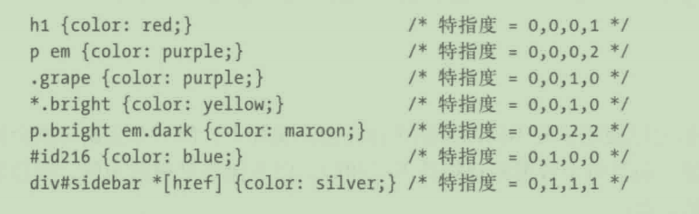
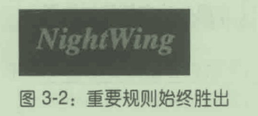

# 第 3 章 特指度和层叠

## 3.1特指度

- 选择符的特指度通过下述规则确定:
  - 选择符中的每个ID属性值加0,1,0,0。
  - 选择符中的每个类属性值、属性选择或伪类加0,0,1,0。
  - 选择符中的每个元素和伪元素加0,0,0,1。
  - 连结符和通用选择符不增加特指度。



### 3.1.1声明和特指度

- 选择符的特指度确定之后,
  - 其值将赋予关联的每个声明。

- 如果多个规则匹配同一个元素，而且部分声明之间有冲突，
  - 特指度就发挥作用了。

### 3.1.2通用选择符的特指度

- 通用选择符不增加特指度。
  - 它的特指度为0,0,0,0，
  - 这与没有特指度是不同的

- 连结符不同，
  - 它根本没有特指度，
  - 即连零都没有。

### 3.1.3 ID和属性选择符的特指度

- ID选择符（#answer)
  - 为总特指度贡献0,1,0,0。
- 属性选择符（[id="totals"])
  - 为总特指度贡献0,0,1,0

### 3.1.4 行内样式的特指度

- 行内声明的特指度为1,0,0,0。

### 3.1.5重要性

- 重要声明(important declaration
  - 在声明末尾的分号之前插入!important

- 如果想把两个声明都标记为重要的,
  - 每个声明中都要插入 !important:

- 带有!important的声明会与不重要的声明分开处理。
- 所有带!important的声明会放在一起，
  - 特指度冲突就在这个范围内解决

- 非重要的声明作为一个整体，
  - 其中的冲突使用特指度解决。
- 重要声明和非重要声明冲突时,
  - 重要声明始终胜出。

```
h1 {
    font-style: italic;
    color: gray !important;
}

.title {
    color: black;
    background-color: silver;
}

* {
    background: black !important;
}
```

```
<h1 class="title">NightWing</h1>
```



## 3.2继承

- 继承指某些样式
  - 不仅应用到所指的元素上，
  - 还应用到元素的后代上。

- 属性值绝不向上传播，
  - 即元素的样式绝不传给祖辈元素。

- 很多属性是不继承的，

  - border属性不继承

  - 多数盒模型属性不继承，

- 继承的值没有特指度，
  - 连零都没有。

## 3.3层叠

- CSS的层叠规则如下:

  - 1.找到匹配特定元素的所有规则。

  - 2．按显式权重排序应用到特定元素上的所有声明。
    - 以!important标记的规则比没有这
      一标记的权重高。

- 3.按来源排序应用到特定元素上的所有声明。声明有三个来源:创作人员、读者和
  用户代理。正常情况下，创作人员编写的样式击败读者提供的样式;读者样式中以!important标记的声明比其他样式权重高，包括创作人员编写的样式中以!important标记的声明;创作人员和读者样式覆盖用户代理的默认样式。
- 4．按特指度排序应用到特定元素上的所有声明。特指度高的声明具有较高的权重。
- 5．按声明的前后位置排序应用到特定元素上的所有声明。样式表或文档中靠后的声明
  权重较高。导入的样式表中的声明放在当前样式表中所有声明的前面。