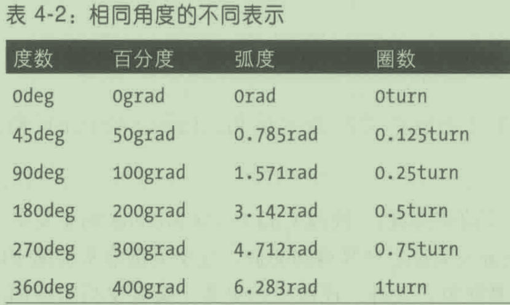

# 第 4 章 值和单位

### 4.1关键字、字符串和其他文本值

### 4.1.1关键字

- 值用一个词表示,
  - 这叫关键字。
- none是一个十分常见的关键字，
  - 它与0(零)不同。

- 如何移除HTML文档中链接的下划线？

```
a:link, a:visited {
    text-decoration: none;
}
```

- 如果想为链接加上下划线,
  - 要使用关键字underline。

#### 全局关键字

- “全局”关键字，规范中的每个属性都能使用: 
  - inherit、 initial、unset。
- inherit关键字把元素某个属性的值设为
  - 与父元素同一属性的值一样。
  - 这个关键字强制继承

- 直接指定的样式覆盖继承的样式
  - 但是 inherit 能把这种情况反过来

- 使用inherit 还能把通常情况下
  - 不从父元素继承的属性值强制拉过来

- initial关键字把属性的值设为预定义的初始值
  - 相当于“重设”值

- unset 关键字是inherit和initial的通用替身。
  - 对继承的属性来说，unset的作用与inherit一样;
  - 对不继承的属性来说，unset的作用与initial一样。

- 这三个全局关键字在所有属性中都可以使用。
- all属性只接受这几个全局关键字


- all表示除direction和 unicode-bidi之外的所有属性。

### 4.1.2字符串

- 字符串值指放在单引号或双引号内的任意字符序列，
  - 定义可取的值时以\<string>表示。

- 前后引号要一致，即首尾两个引号是同一种。

- 字符串中还可以有引号，只要不与外层的引号同样就行，
  - 也可以使用反斜线转义:

- 字符串的定界符只能使用'和"。
  - 文档要使用Unicode编码,不过这就是推荐的编码

- 如果字符串值中有换行，可以转义换行符。
  - CSS会去掉换行符

- 下面两个字符串在CSS看来是一样的:

```
"This is the right place 
for a newline."

"This is the right place for a newline."
```

- 如果真想在字符串中插入一个换行符，
  - 在需要换行的地方使用 Unicode字符\A:

```
"This is the right place\Afor a newline."
```

### 4.1.3URL

- 引用 URL的一般格式如下:

```
url(protocal://server/pathname)
```

- 这是一个绝对URL。
  - “绝对”的意思是不管位于何处都能找到，
  - 因为这种URL在网络空间中定义了一个绝对位置。
- URL 的另一种类型是相对 URL，
  - 因为它的位置相对于所在的文档。
- 如果指代一个相对位置
  - 一般的格式为:

```
url(pathname)
```

- 指代的文件必须与网页在同一个服务器

- 在 CSS中，相对URL 相对于所在的样式表
  - 而不是使用样式表的文档。

- url和开始括号之间不能有空格:

```
body {
    background: url(http://www.pix.web); /*正确*/
}
body {
    background: url (http://www.pix.web); /*错误*/
}
```

### 4.1.4 图像

- 图像值引用的是图像。
  - 句法使用\<image>表示。

- \<image>表示下面三种值中的一个:
  - \<url>
    - 指向外部资源的URL 标识符。
  - \<image-set>
    - 一系列图像 根据值中的条件选择。
      - image-set()可以指定
        - 用于桌面布局的大图，
        - 用于移动布局的小图
  - \<gradient>
    - 线性渐变或径向渐变图像，
      - 可以是单个的，也可以重复。

### 4.1.5标识符

- 有些属性接受标识符值，即用户定义的某种标识符
- 在取值句法中使用\<identifier>表示。
- 标识符本身是词,而且区分大小写。
- 不要把标识符定义地跟有效的关键字一样。

## 4.2数字和百分数

### 4.2.1整数

- 整数值由一到多个数组成，
  - 前面可以有＋或-号，分别表示正数和负数。
- 在取值句法中，整数值用\<integer>表示

- 取值范围外的整数值默认是无效的，会导致整个声明被忽略。
- 取值范围外的整数会被设为与所用值最接近的数，
  - 这种行为称为clamping
- 如果未明确限制取值范围，用户代理必须接受
  - 土1 073 741824(土2^30)之内的数。

### 4.2.2数字

- 数字值是\<integer>或实数，
  - 后者指整数后跟一个点号，再跟着一些整数。
  - 前面可以加上+或-，表示正数或负数。
- 在取值句法中，数字值用\<number>表示

- \<number>可以是\<integer>，也可以是另一种类型的值，
  - 有些属性只接受整数(例如z-index)，
  - 有些则接受任何实数（例如flex-grow)。
- 对于取数字值的属性来说，取值范围可能有限。
- opacity属性的值被限制在0到1(含)之间的有效\<number>。
- 在定义的取值范围之外的数字值是无效的,
  - 会导致整个声明被忽略。
- 取值范围外的数字会被设为与所用值最接近的数
  - (这种行为一般称为clamping)。

### 4.2.3百分数

- 百分数值是在\<number>后跟一个百分号（%），
- 在取值句法中用\<percentage>表示。
- 百分数值始终相对于另一个值，另一个值可以是任何值，
- 接受百分数值的属性都会
  - 定义取值范围,
  - 以及百分比相对什么计算。

### 4.2.4弹性值

- 弹性值是\<number>后跟fr
  - 单位弹性值是1fr。
- 这个概念由栅格布局引入,
  - 用于把布局中不受限制的空间分成几部分

## 4.3距离

### 4.3.1绝对长度单位

- 绝对长度单位有七个，说明如下:

  - 英寸（in)
    - 美国尺子所用的英寸
  - 厘米（cm)
    - 指世界上其他地方使用的尺子上的厘米

  - 毫米（mm)
    - 1厘米等于10毫米，
  - 四分之一毫米（q)
    - 1厘米中有40个q单位

  - 点（pt)
    - 点是一个标准的印刷度量单位，
    - 在打印机和打字机上使用
    - 字处理程序也使用

  - 派卡（pc)
    - 派卡（pica）也是印刷术语。

  - 像素（px)
    - 像素是屏幕上的小点,
    - 在CSS中，1像素所占的尺寸够1英寸中放下96像素。
    - 缩放页面或打印时要考虑缩放，
      - 100px宽的元素经渲染后得到的宽度
      - 可能大于设备上的100个小点。

- 对 Web 浏览器来说,
  - 显示效果受屏幕的尺寸和设定的分辨率影响,
- 绝对单位在定义文档的印刷样式时非常有用，
  - 因为打印机通常使用英寸、点和派卡。

#### 像素长度

- 靠近屏幕，可以看到屏幕上排布着网格状的小方块。
  - 一个方块就是一像素。

- 屏幕就是由一个个像素点构成的。
- 打印机，用户代理将根据情况缩放像素长度。
  - 打印代码要确定一像素有几点

- 像素度量还常用于表示图像的尺寸,
  - 即一个图像是多少像素高、多少像素宽。
- 矢量图像（如SVG)严重依赖图像缩放技术。

#### 像素理论

### 4.3.2分辨率单位

- 为了描述显示器的分辨率,出现了三个新单位。

  - 点每英寸（dpi)
    - 在长为1英寸的范围内能显示的点数。

  - 点每厘米（dpcm)
    - 测量的范围是1厘米,而不是1英寸。

  - 点每像素单位（dppx)
    - CSS中每个px单位显示的点数。
    - 从 CSS3起,1dppx，相当于96dpi，

- 这些单位只能在媒体查询中使用

### 4.3.3相对长度单位

#### em 和 ex单位

- em和 ex
  - 1 em 等于元素的 font-size属性值。
- 如果元素的font-size为14像素，
  - 1em就等于14像素。

- 1 em等于所用字体中小写字母m的宽度。

- ex指所用字体中小写字母x的高度。

- 不同字体中的x高度有所不同

#### rem单位

- em相对当前元素的字号计算，
  - rem 相对根元素计算。
- 在 HTML中，根元素是 html。

- rem 的实际作用相当于重设字号
  - font-size: 1rem;都会把字号还原成根元素设定的大小。
- 1rem是用户的默认字号，
  - 除非用户为根元素设定了其他字号

- 如果没为根元素设定字号的话
  - font-size: 1rem的作用与 font-size: initial相同。

#### ch单位

- ch等于渲染时所用字体中“0”(零,U+0030）字形的进距。

- “进距”对应于字体排印中的“进宽”
- 字形的进宽指
  - 一个字形的起点到下一个字形的起点之间的距离。
- 这段距离等于字形本身的宽度加上侧边的间距
  - （间距可以为正也可以为负)。

- CSS 把 ch单位定义为所用字体中一个零的进宽。

#### 视区相关的单位

- 视区宽度单位（vw)
  - 这个单位根据视区的宽度计算,然后除以100。
  - 如果视区的宽度是937像素，那么1vw等于9.37px。
  - 如果视区的宽度有变，vw的值随之改变。

- 视区高度单位(vh)
  - 这个单位根据视区的高度计算，然后除以100
  - 如果视区的高度是650像素,那么1vh等于6.5px
  - 如果视区的高度有变，vh的值随之改变。

- 视区尺寸最小值单位（vmin)
  - 这个单位等于视区宽度或高度的1/100，
    - 始终取宽度和高度中较小的那个
  - 如果一个视区的宽度为937像素,高度为650像素,
    - 那么1vmin等于6.5pX。
- 视区尺寸最大值单位（vmax)
  - 这个单位等于视区宽度或高度的1/100，
    - 始终取宽度和高度中较大的那个。
  - 如果一个视区的宽度为937像素，高度为650像素,
    - 那么1vmax等于9.37pX。

- 这些单位特别适合用于创建全视区界面，
  - 例如移动设备的界面，
  - 因为元素是根据视区的尺寸而变化的，
  - 不用担心特定情况下视区的具体尺寸。

## 4.4 计算值

- CSS 提供了calc(）值。括号中可以使用简单的数学算式。
- 允许使用的运算符有+（加)、-（减)、*(乘)、/(除)，以及括号。
- calc()不允许做指数运算。

- calc()会检查括号中各个值的类型，确保是兼容的。
- 检查的方式如下:

- 1. +和-号两侧的值必须使用相同的单位类型

  - 5 ＋2.7是有效的
  - 5em + 2.7无效
  - 5em + 20px是有效的

- 2，\*计算的两个值中必须有一个是\<number>

  - 2.5rem \* 2 和 2* 2.5rem都是有效的
  - 2.5rem * 2rem是无效的,这是面积单位

- 3./计算的两个值中右边的那个必须是\<number>。
  - 左边是\<integer>时,结果为一个\<number>值;
    - 否则，结果的单位与左边的值一样。
  - 30em / 2.75是有效的，
  - 30/ 2.75em是无效的。

- 4．任何情况下都不能除以零。
  - 30px/0

- ＋和-运算符的两侧必须有空白，*和/没有这一限制

- calc()中的算式至少可以使用20个算子，
  - 算子可以是数字、百分数，也可以是大小量（长度)。
  - 超过这一限制的算式应该视为无效的。

## 4.5属性值

- 可以使用样式对应的元素上的 HTML 属性值。
  - 方法是使用attr()表达式。

- 使用生成的内容时，可以插入任何属性的值

```
p::before {
    content: attr(id);
}
```

- 这个表达式把id属性的值加在有id属性的段落前面。

## 4.6颜色

### 4.6.1具名颜色

- 如果只想使用基本的颜色,最简单的方法是使用颜色的名称
- CSS 把这种颜色称为具名颜色(named color)。
- 早期，CSS中有16个基本的颜色关键字，


- 最新的CSS颜色规范包含这16个具名颜色，
  - 不过它们属于一个更大的列表，一共有148个颜色关键字。

### 4.6.2 RGB和 RGBa颜色

- 计算机中的颜色按不同比例的红绿蓝混合而成，
  - 经常被称为RGB 颜色。
- 显示器上的一个点是一个像素。
- 采用这种方法创建的颜色有4种指定方式。

#### 函数式RGB颜色

- 有两种颜色值使用函数式RGB表示法，
  - 而不使用十六进制表示法。
- 这种颜色值的一般句法是 rgb(color)，
  - 其中 color是三个值，可以是百分数或整数。
  - 百分数的取值范围是0~100%，
  - 整数的取值范围是0~255。

- 使用百分数表示白色和黑色的方式如下:

```
rgb(100%, 100%, 100%)
rgb(0%, 0%, 0%)
```

- 使用三个整数表示的方法如下:

```
rgb(255, 255, 255)
rgb(0, 0, 0)
```

- 一个颜色值中不能混用整数和百分数
  - rgb(255,66.67%, 50%）是无效的,将被忽略。

- 超出取值范围的数将“裁剪”为最近的边界值。

#### RGBa颜色

- 这种表示法在RGB 的三个通道后面增加了一个 alpha值，
  - 即“red-green-blue-alpha”，简称RGBa。
  - 这里的alpha指alpha通道,用于衡量不透明度。

- alpha值始终是0-1范围内的实数。
  - 如果想让颜色完全透明，把 alpha值设为0;
  - 如果想完全不透明，应该设为1.
- 超出范围的值要么被忽略，要么被重置为最近的有效值
- alpha值不能使用\<percentage>表示

#### 十六进制RGB值

```
h1 {
    color: #FF0000;
}
```

- 把三个00到 FF 范围内的十六进制数串在一起表示一个颜色。
- 一般的句法是#RRGGBB。
  - 这三个数之间没有空格、逗号或其他分隔符。

- 十六进制表示法与三个整数表示法在数值上是等效的。
  - rgb(255,255,255）与#FFFFFF 完全等效，
  - rgb(51,102,128）则与#336680一样。
- 如果每个十六进制数中的两个数字相等，使用简短表示法。
  - 一般的句法是#RGB:

```
h1 {
    color: #000;
}
```

- 浏览器会把每个数字复制成两个。
  - #F00变成了#FF0000，
  - #6FA变成了#66FFAA,#FFF 变成了#FFFFFF

#### 十六进制RGBa 颜色

- 有个新的十六进制表示法在后面添加个十六进制值,
  - 表示 alpha通道的值。

```
p.one {
    color: #000000FF;
}
p.two {
    color: #000000CC;
}
```

- 如果四个十六进制值中的两个数字都一样，可以简写。
  - #663399AA 可以写成#639A。
- 如果有任何一个十六进制数的两个数字不一样，
  - 就必须完整写出八个数字。
  - #663399CA不能简写为#639CA。

### 4.6.3 HSL 和 HSLa颜色

- HSL是 Hue（色相)、Saturation(饱和度)和 Lightness（明度)
  - 色相是角度值，取值范围是0~360,
  - 饱和度是从0(无饱和度)~100(完全饱和)的百分数,
  - 明度是从0(全暗)~100(全明)的百分数。

- 色相分布在一个色相环上，
  - 随着角度的旋转得到色谱上的不同颜色。
  - 0°是红色，旋转360°又回到红色

- 饱和度衡量颜色的强度。
  - 饱和度为0%时，得到的都是不太暗的灰色;
  - 饱和度为100%时,在明度一定时，色相最饱满。
- 明度定义颜色有多暗或多亮。
  - 明度为0%时,始终为黑色;
  - 明度为100%时,得到的是白色

```
p.one {
    color: hsl(0, 0%, 0%);
}

p.two {
    color: hsl(60%, 0%, 25%);
}
```


- 把 HTML4定义的16个颜色关键字


- HSLa在 HSL的三个值后面加上一个alpha值，
  - 取值范围是0~1。

```
p.one {
    color: hsl(0, 0%, 0%, 1);
}

p.two {
    color: hsl(60%, 0%, 25%, 0.8);
}
```

### 4.6.4颜色关键字

- 有两个特殊的关键字
  - 可以在任何允许使用颜色值的地方使用:
  - transparent和currentcolor。

- transparent表示完全透明的颜色。
  - 它与 rgba(0,0,0,0)等效。
- 这个关键字是元素背景色的默认值。
- 用它为元素定义只占空间但不可见的边框

- currentColor的意思是，“当前元素color属性计算得到的值”。

```
main {
    color: gray;
    border-color: currentColor;
}
```

- 第二个声明使用currentColor复制color属性计算得到的值
  - 这里是 gray

## 4.7角度

- 角度一般使用\<angle>表示,
  - 即一个\<number>后跟下列四个单位中的一个。

- deg
  - 度数，完整的圆周是360度。
- grad
  - 百分度, 完整的圆周是400百分度。
- rad
  - 弧度，完整的圆周是2Π（近似于6.28)。

- turn
  - 圈数,一个完整的圆周是一圈
  - 旋转10圈就是10turn
  - 复数形式turns是无效的，

- 角度单位最常在2D 和3D变形中使用，
- HSL颜色中不使用角度单位,
- 色相角度始终是度数，而且不加deg单位。



## 4.8时间和频率

- 属性的值为一段时间时,使用\<time>表示,
- 它是一个\<number>值后跟s(秒)或ms(毫秒)
- 时间值最常在过渡和动画中使用，
  - 用于定义持续时间或延迟时间。

- 视听 CSS 也能用到时间值,用于定义持续时间或延迟时间。

- 视听CSS中还有一种值\<frequency>，
  - 它是一个\<number>值后跟Hz(赫兹)或kHz(千赫兹)。
  - 这个单位的标识符不区分大小写,
    - Hz和hz是等效的

## 4.9位置

- 位置值用于指定图像在背景区域中的位置，
  - 使用\<position>表示。

- 位置值的句法结构相当复杂:


- 如果只声明一个值，那么第二个值将被设为center。
  - left的作用与left center一样
  - 25%的作用与25% center一样。

- 如果声明两个值
  - 第一个值是长度或百分数，
  - 前一个值始终是横向值。
- 25% 35px来说，
  - 25%是横向距离，35px是纵向距离。
- 如果调换顺序，写成35px 25%，
  - 35px就是横向距离，25%变成了纵向距离。
- 如果写成25% left或35px right，整个值都无效，
  - 因为两个值都是横向距离，没有指定纵向距离

- 如果声明四个值
  - 必须有两个长度或百分数，
  - 而且前面都得是关键字。
- 长度或百分数指定偏移距离，
  - 而关键字定义偏移以哪一边计算。
- right 10px bottom 30px表示
  - 右边向左偏移10像素，
  - 底边向上偏移30像素。
- top 50% left 35px表示
  - 顶边向下偏移50%，
  - 左边向右偏移35像素。

- 三个值的处理方式跟四个值一样，
  - 不过最后一个偏移量将被设为零(即不偏移)。
  - right 20px top 的作用与right 20px top 0一样。

## 4.10自定义值

- “自定义属性”的作用其实在CSS 中创建变量。
  - 它并不创建特殊的CSS属性（像color或font之类的)。

```
html {
    --base-color: #639;
    --highlight-color: #AEA;
}

h1 {
    color: var(--base-color);
}

h2 {
    color: var(--highlight-color);
}
```

- 自定义值--base-color和 --highlight-color的定义。
- 这不是某种特殊的颜色类型,
  - 而是根据值的作用而选择的名称。
- 自定义标识符以两个连字符开头(--)
  - 调用的方法是使用var()值类型
- 这些名称是区分大小写的
  - --main-color和 --Main-color是完全不同的

- 这些自定义标识符通常被称为“CSS变量”
- 自定义属性有个有趣的特性:
  - 作用域在一定的范围内。

```
html {
    --base-color: #639;
}

aside {
    --base-color: #F60;
}

h1 {
    color: var(--base-color);
}
```

```
<body>
  <h1>Heading 1</h1>
  <p>Main text.</p>
  <aside>
    <h1>Heading 1</h1>
    <p>An aside.</p>
  </aside>
  <h1>Heading 1</h1>
  <p>Main text.</p>
</body>

```


- 能查询特性的@supports()。
  - 使用变量的样式规则能隐藏起来，不产生影响;

```
@supports (color:var(--custom)) {
    /* 使用变量的样式 */
}

@supports (--custom:value) {
    /* 替代样式 */
}
```

