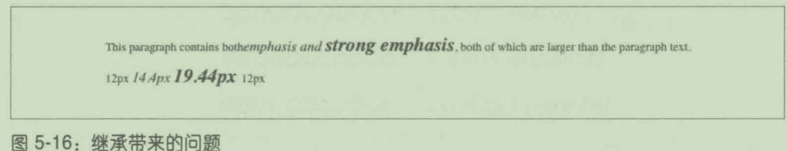

# 第 5 章 字体

## 5.1字体族

- CSS定义了五种通用字体族:

- 衬线字体
  - 这种字体中有衬线
  - 衬线是字符笔划末尾的装饰,
    - 小写字母 l 顶部和底部的短线
    - 大写字母A两条竖线底部的短线。

- 无衬线字体
  - 这种字体中无衬线。
    - Helvetica、 Geneva、 Verdana、Arial 、Univers

- 等宽字体
  - 等宽字体中的字形宽度一样。
  - 一般用于显示编程代码或表格数据。
  - 这种字体可以有衬线,也可以无衬线。
  - Courier、Courier New,Consolas、Andale Mono

- 草书字体
  - 这种字体尝试模仿人类笔迹或手写体。
  - 这种字体在笔划末端有较大的花饰
  - Zapf Chancery、Author和 Comic Sans都是草书字体。

- 奇幻字体
  - 这种字体没什么统一的特征，
  - 无法将其划归到其他类别中。
  - Western、Woodblock和 Klingon都是奇幻字体。

- 任何一款字体都可归为上述通用字体族中的一个

### 5.1.1使用通用字体族

- 字体族使用font-family属性声明。


- 如果想让一个文档使用无衬线字体
  - 由浏览器选择一款无衬线字体

```
body {
    font-family: sans-serif;
}
```

### 5.1.2指定字体族

- 笔者强烈建议始终在font-family规则中指定通用字体族。
- 在用户代理找不到匹配的字体时,选择一个字体代替。

```
h1 {
    font-family: Arial, sans-serif;
}

h2 {
    font-family: Charcoal, sans-serif;
}
```

- 用户代理会按照所列的顺序查找字体
  - 如果找不到列出的任何一款字体
    - 用户代理将选择一款可用的衬线字体

#### 使用引号

- 在 font-family声明中，
  - 如果字体名称中有一个或多个空格
  - 或者字体名称中有符号
    - 建议使用引号。
- 名为Karrank%的字体就应该放在引号里:

```
h2 {
    font-family: Wedgie, 'Karrank%', Klingon, fantasy;
}
```

- 与font-family中可用的关键字同名的字体名称
  - 必须放在引号里。

- 使用的引号既可以是单引号，也可以是双引号。

## 5.2使用 @font-face

- @font-face的作用是让你在设计中使用自定义的字体

```
@font-face {
    font-family: "SwitzeraADF";
    src: url("SwitzeraADF-Regular.otf");
}
```

- @font-face是惰性加载字型的。
  - 仅当需要使用指定的字型渲染文本时，才会加载，
- 浏览器不管是否需要，都会先行下载声明的全部字型，
  - 这是浏览器的缺陷。

### 5.2.1必须的描述符

- 定义字体的全部参数都在 @font-face{}结构中编写
  - 格式为descriptor: value
- 多数描述符都直接使用现有的属性名
- 描述符中有两个是必需的: font-family 和 src


- src :为定义的字型提供一个或多个源。
  - 如果有多个源，之间以逗号分隔。
- 字型的源可以指向任何URI,不过有个限制:
  - 字型必须与样式表同源。
- 你要在自己的服务器中存储一份本地副本，
  - 或者使用同时提供样式表和字体文件的字体托管服务。

- 使用HTTP 首部 Access-Control-Allow-0rigin 设定服务器，
  - 允许跨站加载。

- @font-face做的是低层定义，是为字体相关的属性服务的。

```
@font-face {
    font-family: "SwitzeraADF"; /*描述符*/
    src: url("SwitzeraADF-Regular.otf");
}
h1 {
    font-family: SwitzeraADF, sans-serif; /*属性*/
}
```

- src描述符中以逗号分隔的列表
  - 用于提供后备字体文件。
- 一旦用户代理无法从第一个源下载,
  - 就会尝试从下一个源中下载字体文件:

```
@font-face {
    font-family: "SwitzeraADF";
    /*描述符*/
    src: url("SwitzeraADF-Regular.otf"),
        url("/fonts/SwitzeraADF-Regular.otf");
}
```

- 如果指向其他服务器，通常无法下载
  - 除非设置服务器允许跨源访问

- 如果想告诉用户代理所用的字体是什么格式

  - 可以使用可选的 format()

  - 让用户代理跳过不支持的字体格式

  - 还能为不带有常规扩展名的字体文件指定格式，
    - 以防用户代理不识别

```
@font-face {
    font-family: SwitzeraADF;
    src: url("SwitzeraADF-Regular.otf") format("opentype");
}
```


- 使用local()指定已经安装在用户设备中的字体族名称
  - （可以是多个):

```
@font-face {
    font-family: SwitzeraADF;
    src: local("Switzera-Regular"),
        local("SwitzeraADF-Regular"),
        url("SwitzeraADF-Regular.otf") format("opentype");
}
```

- 用户代理先检查设备中是否有
- 名为“Switzera-Regular”或“SwitzeraADF-Regular"的字体族，
- 如果有，使用SwitzeraADF 这个名称指代本地安装的字体;
- 如果没有，尝试从远端下载ur1（(）中指定的字体文件。

- 借助这个功能可以为本地安装的字体自定义名称。

```
@font-face {
    font-family: "H";
    src: local("Switzera-Regular"),
        local("SwitzeraADF-Regular");
}

h1, h2 {
    font-family: H, sans-serif;
}
```

#### 万全之策

- 不同时代的不同浏览器支持不同格式的字体
- 应该使用能确保万全的@font-face句法。
  - 这种句法写法如下:


### 5.2.2其他字体描述符

- 还有几个可选的描述符用于为字型指定属性值
  - 控制着用户代理相应属性的处理方式


- 这些字体描述符是可选的，不必一定在@font-face 规则中列出
- 描述符不可以没有默认值
- 如果没有某个可选的描述符,它的值将被设为默认值
- 如果未列出 font-weight，其值默认为normal

#### 限制字符范围

- 有一个字体描述符没有对应的CSS属性
  - 即unicode-range。
- 这个描述符用于指定自定义字体可以应用到哪些字符上。
- 使用符号字体，或者想确保只有特定语言使用指定字型时
  - 用得到这个描述符。


- 默认情况下，这个描述符的值涵盖全部 Unicode字符。
- 这表明,只要字体中有某个字符的字形，
  - 就能用它渲染那个字符。

```
unicode-range: U+590-5FF; /*希伯来语字符*/
unicode-range: U+4E00-9FFF, U+FF00-FF8f, U+30??; /*日语汉字、平假名、片假名*/
```

- 范围必须从小到大
- 可以声明单个码位，例如U+221E。

- 第二个例子 U+30??值问号是通配符，意思是“任何数字”。
  - U+30??等效于U+3000-30FF。
- unicode-range 的值中只允许使用问号这一个“特殊的”字符。

- @font-face是惰性加载的，因此可以使用unicode-range限制
  - 只下载页面中真正需要用到的字型。
- 为了确保用户代理只下载真正需要的字型，可以像下面这样组织@font-face规则:

```
@font-face {
    font-family: "MyFont";
    src: url("myfont-general.otf") format("opentype");
}

@font-face {
    font-family: "MyFont";
    src: url("myfont-cyrillic.otf") format("oprntype");
    unicode-range: U+04??;
}

@font-face {
    font-family: "MyFont";
    src: url("myfont-math.otf") format("opentype");
    unicode-range: U+22??;
}
```


- 第一个规则没有指定Unicode范围，因此始终下载，
- 第二个规则，仅当页面中有指定Unicode范围内的字符时
  - 才下载myfont-cyrillic.otf
- 第三个规则，仅当页面中有基本的算术运算符时才下载

### 5.2.3组合描述符

- 把多个描述符组合在一起为字型设定不同的属性
  - 未声明的描述符使用默认值。

```
@font-face {
    font-family: "SwitzeraADF";
    font-weight: normal;
    font-style: normal;
    font-stretch: normal;
    src: url("SwitzeraADF-Regular.otf") format("opentype");
}
```

## 5.3字重

- 

- 字重越大，字体越黑、越粗。
- 为整个文档指定一个字体族，
  - 然后为不同的元素设定不同的字重。
- 可以使用@font-face和不同的 font-weight值

```
b {
    font-weight: bold;
}
```

- 如果一个段落使用Times显示，其中有部分加粗文本，
- 那么这个段落其实是使用同一字体的两个字型显示的:
  - Times和TimesBold。
  - 常规文本使用 Times显示，
  - 加粗文本使用 TimesBold显示。

### 5.3.1字重的工作方式

- 关键字100到900对应于字体设计中的九级字重。
  - 100是最细的,
  - 900是最粗的。
- 每个数字对应的权重至少和前面的数字具有相同的字重。
  - 100、200、300 和400可能都对应于同样细的变体;
  - 500和600对应于同样粗的变体;
  - 700、800和900则对应同样较粗的变体。
- 这些数字对应于常见的变体名称
- 400对应于normal，700对应于 bold。
- 以“Normal”“Regular”“Roman”或“Book"等表示的
  - 可以分配给数字400，
- 以“Medium”表示的可以分配给数字500。
- 如果只有一个变体，而且以“Medium”表示，
  - 那么应该分配给400，而非500。

- 如果给定的字体族中字重的等级少于9个，
  - 用户代理必须填补既定方式的空缺:

- 如果500未分配,与400对应的字重一样。
- 如果300未分配，将其对应于比400细的那个变体。
  - 如果没有这样一个变体，字重与400一样。
    - 此时,通常为“Normal”或“Medium”变体
  - 200和 100也是这样处理的。
- 如果600未分配，将其对应于比500 黑的下一个变体。
  - 如果没有这样一个变体，字重与500一样。
  - 700、800和 900也是这样处理的。

- 很少有字体族会提供9级字重


### 5.3.2增大字重

```
p {
    font-weight: bolder;
}
```


- 如果把一个元素的字重设为bolder，
  - 用户代理首先要确定从父元素继承的font-weight值
    - 然后选择比继承的字重高一级的最小数字。
  - 如果找不到，用户代理把元素的字重设为下一个数字值,
    - 直到900;到顶后,就把字重设为900。

### 5.3.3减小字重

```
strong {
    font-weight: lighter;
}
```

### 5.3.4 font-weight描述符

- 使用font-weight描述符可以为字型指定
  - font-weight属性支持的字重等级。

- font-weight描述符的值inherit关键字除外。

```
@font-face {
    font-family: "SwitzeraADF";
    font-weight: normal;
    src: url("f/SwitzeraADF.otf") format("opentype");
}
```

## 5.4字号


- font-size属性相对大小关键字，分别为larger和 smaller。
  - 分别增大和减小一号字体大小。
- em方框
  - 指的是在没有行距的情况下两条基线之间的距离。
- 字体中存在高度超过基线之间距离的字符。
  - 设计字体时要确保所有字符都比em方框小。


- font-size的作用是为字体的em方框提供一个尺寸。

### 5.4.1绝对大小

- 绝对大小关键字。
- font-size支持的绝对大小值有七个:
  - xx-small、x-small、small、medium、
  - large、x-large和 xx-large。
- 这几个关键字没有固定的大小,而是相对而言的

```
p.one {
    font-size: xx-small;
}
```


### 5.4.2相对大小

- 关键字larger 和 smaller 
  - 根据父元素的字号增大或减小一定比例,
- 使用的换算系数与计算绝对大小时一样。

- 字号的相对值没有上下限
  - 字号可以小于xx-small或大于 xx-large

### 5.4.3百分数和 em

- 百分数根据继承自父元素的字号计算。
- 百分数能更为细致地控制字号

- 对字号而言，1em与100%的效果相同
- 使用em 单位时,百分数的规则同样适用
  - ,例如基于继承的字号计算等。

### 5.4.4字号的继承

- CSS 中的字号继承的是计算得到的值，而不是百分数本身
- 百分数也会累积。

```
<p>
  This paragraph contains both
  <em>emphasis and <strong>strong emphasis </strong></em>, both of which are
  larger than the paragraph text.
</p>
<p>
  12px <em>14.4px <strong>19.44px</strong></em> 12px
</p>

```



#### 显示时舍入

- 在内部维护着小数字号，但渲染引擎不一定会使用。

#### 关键字和等宽文本

- 字号关键字的继承会导致实际大小缩水，
  - 这在某些浏览器渲染等宽文本时尤为明显。

```
p {
    font-size: medium;
}

span {
    font-family: monospace;
    font-size: 1em;
}
```

```
<p>This is a 'p' with a <span>'span'</span> inside</p>

```


- medium 的默认值一般是16px
- 有些浏览器中span 元素中的等宽文本是13px。

- 继承向下传递的是关键字medium
  - span 中的字号是根据medium计算的。
- 为了算出具体的字号,用户代理会查看用户的偏好设置，
  - 而多数浏览器为等宽文本设定的默认字号是 13px

- 不是所有浏览器都是这样处理的
  - 文本在不同浏览器中显示的大小不一致
- 有些浏览器会覆盖medium默认的对应关系
  - 根据父元素的字号计算实际值
- 有个方法能绕开这个问题,而且对已知的浏览器都有效

```
p {
    font-size: medium;
}

span {
    font-family: monospace, serif;
    font-size: 1em;
}
```

-  serif，在所有浏览器中，
  - font-size: 1em的意思都是段落实际字号的100%

### 5.4.5使用长度单位

- font-size可以设为任何长度值。

```
p.one {
    font-size: 36pt;
}
p.two {
    font-size: 3pc;
}
p.three {
    font-size: 0.5in;
}
p.four {
    font-size: 1.27cm;
}
```

- 一个缺点:
  - 不是所有浏览器都能缩放像素值设定的文本
- 有时使用像素值设定的文本
  - 在模仿全屏幕设备的移动设备中的实际字号特别小
- 一般不推荐使用像素值设定字号。

### 5.4.6 自动调整字号

- 有两个因素影响字体是否清晰易辨:字号和x高度。
- x高度除以字号得到的结果称为高宽比值
  - 随着字号的减小,高宽比值越高，字体越清晰易辨;
- CSS 提供的font-size-adjust属性用于
  - 改变字体族之间的高宽比值


- 这个属性的作用是在所用的字体不是创作人员的首选时
  - 维持清晰性。


- 假设用户代理能找到或算出高宽比值，
  - 把 font-size-adjust 设为 auto就能达到所需的效果，
- 假设用户代理能确定Verdana的高宽比值是0.58

- font-size-adiust: none;声明将禁止调整字号。
  - 这是默认的行为。

## 5.5字形

- font-style属性
  - normal（常规)
  - italic（斜体）
  -  oblique（倾斜体）


- font-style的默认值是normal。
  - 这表示竖直体即没有倾斜。
- italic和 oblique之间的区别
  - 斜体是一种单独的字型
    - 除了字符有点斜之外，字符本身还可能会做调整。
  - 倾斜体只是竖直体的倾斜版本。

- 如果想让文档中的文本以人们熟知的方式使用斜体，

#### font-style描述符

- 用作描述符时，font-style把指定的字型对应到指定的字形

```
@font-face {
    font-family: "SwitzeraADF";
    font-style: normal;
    src: url("SwitzeraADF-Regular.otf");
}
```

- font-style描述符的值可以是 font-style属性允许取的值中
  - 除了inherit之外的其他任何值。

## 5.6字体拉伸

- font-stretch属性，用于选择较宽或较窄的字母型式
  - 无需在 font-family声明中指定使用单独的字体族。
  - 目的是在同一个字体族中提供瘦体和胖体。


- 仅当使用的字体族中有加宽变体时
  - font-stretch:expanded声明才起作用;

#### font-stretch描述符

- font-stretch 描述符的作用是把不同宽度的字型
  - 分配给font-stretch属性允许取的不同宽度值。

```
@font-face {
    font-family: "SwitzeraADF";
    font-stretch: normal;
    src: url("SwitzeraADF-Regular.otf");
}
@font-face {
    font-family: "SwitzeraADF";
    font-stretch: condensed;
    src: url("SwitzeraADF-Regular.otf");
}
```

## 5.7字距调整

- 字符之间相对位置的数据，即字距。
- 不同的字符组合，字距是不一样的。
  - oc字距可能就与ox 不同。
- 字距可以使用 font-kerning 属性呼出或禁止


- none让用户代理忽略字体中的字距信息。
- normal 让用户代理正常处理字距，使用字体中的字距数据。
- auto把决定权交给用户代理，
  - 让用户代理选择最合适的处理方式，
- 如果既调整字距,又应用letter-spacing属性,正确的顺序是
  - 先调整字距,
  - 然后再根据letter-spacing属性的值调整字符间距

## 5.8字体变形

- 变形信息内嵌在字型中，
- 如果字型中有这些变形信息,
  - 可以通过CSS的 font-variant属性调用。


- CSS1和 CSS2只有两个取值:
  - 一个是 normal，表示普通形式;
  - 一个是 small-caps，指定使用小号大写字母。
    - 
      小号大写字母是大小稍有区别的大写字母

```
h1 {
    font-variant: small-caps;
}

h1 code, p {
    font-variant: normal;
}
```


### 5.8.1 Level3新增的值

- 这些值其实是下述属性允许的取值总和:


- 不是每个字体都支持每一种变形
- 字体中有某个变形,也不表示在所有浏览器中都能调用

### 5.8.2 font-variant 描述符

- font-variant描述符通过一个空格分隔的列表指定
  - 字型的哪些变体可以使用，哪些不能使用
- 启用常见的连字、小号大写字母和带贯穿线的零:

```
font-variant: common-ligatures small-caps slashed-zero;
```

- font-variant描述符的值可以是 font-variant属性允许的取值中
  - 除了inherit关键字之外的任何值。

- font-variant描述符
  - 在@font-face规则中指明允许使用的变形
  - 能轻易覆盖属性中指定的字体变形。

```
@font-face {
    font-family: "SwitzeraADF";
    font-weight: normal;
    src: url();
    font-variant: stacked-fractions titling-caps slashed-zero;
}
```

## 5.9字体特性

- font-feature-settings属性从低层控制
  - OpenType字体的哪些特性可以使用


- 这个属性的值可以是 OpenType规范定义的一个或多个特性
- 若想启用常用的连字、小号大写字母和带贯穿线的零

```
font-feature-settings: "liga" on, "smcp" on, "zero" on;
```


- 多数特性的值是整数0和1，相当于off 和 on
  - 大于1时既表示启用特性,也用于定义选择的索引
- 如果列出了某个特性,但是没有提供数字，假定为1(启用）
- 所有\<string>值都必须放在引号里。
  - 下述规则中的第一个特性有效，而第二个将被忽略

```
font-feature-settings: "liga", dlig;
```

- OpenType要求所有特性标签都是四个 ASCII 字符长。
- 默认情况下，OpenType字体都启用了下述特性，


#### font-feature-settings描述符

- font-feature-settings描述符指定
  - OpenType字型的哪些特性可以使用，哪些不能使用,
  - 多个特性以逗号分隔。
- font-variant描述符几乎涵盖font-feature-settings的一切功能,
  - 外加一些其他作用。
- 建议创作人员使用font-variant，
- 只在想要的字体特性不在 font-variant 的取值范围内时
  - 才使用font-feature-settings。
- 这个描述符只是把特性提供出来
  - 并不在显示文本时真正启用

- font-feature-settings描述符的作用是定义@font-face规则中
  - 所声明的字型允许使用哪些字体特性

## 5.10字体合成

- CSS 提供了font-synthesis属性，
  - 控制合成哪种字型，或者在渲染页面时禁止合成。


- 如果字体族中没有粗体，用户代理会生成粗体。
- 如果字体族中缺少斜体，用户代理会合成斜体。
- font-synthesis: none声明将阻止
  - 用户代理在对应的元素上做这种合成。

## 5.11 font属性


- font声明可以使用
  - 所列属性允许的任何一个值
  - 或者是系统字体值

- 如果其中某个属性的值是normal，甚至不用写出

- 只有font属性的前三个值顺序自由
  - 后两个值的顺序要严格得多
- 后两个值不仅必须是font-size和 font-family这种顺序
  - 而且必须出现在font声明中

### 5.11.1加入行高

- 通过 font属性还能设定line-height属性的值
- 设定的方法是在 font-size中增加一个值,以正斜线（/)分隔

```
h2 {
    font: bold italic 200%/1.2 Verdana, Helvetica, Arial, sans-serif;
}
```

- font-size始终在 line-height前面，不能反过来，
  - 而且两个值之间要以斜线分隔。
- font属性必须的两个值是 font-size和 font-family，
  - 而且必须以这样的顺序编写，
  - 其他值都是可选的。

### 5.11.2正确使用简写

- 使用font属性时,省略的值都将重设为默认值。

### 5.11.3使用系统字体

- 如果想让网页与用户的操作系统融为一体，
  - 可以在font声明中使用系统字体值。
- 元素上应用的是操作系统中控件的
  - 字号、字体族、字重、字形和变形。
- 可用的系统字体值如下


- 系统字体或许只能作为一个整体设置,
  - 即字体族、字号、字重、字形等必须一起设置。
- ,设定系统字体之后可以调整单个属性的值。

- 想把按钮的字体设成与操作系统中的按钮一样,

```
button {
    font: caption;
}
```

```
button {
    font: caption;
    font-size: 1em;
}
```

- 如果调用的系统字体在用户的设备中不存在
  - 用户代理可能会尝试模拟
  - 例如减小caption字体的字号，得到small-caption字体
  - 如果做不到这一点，用户代理应该使用默认字体。
- 如果能找到指定的系统字体，但是无法读取全部值，
  - 用户代理应该使用默认值。

## 5.12字体匹配机制

- 1．用户代理创建或访问字体属性数据库
  - 这个数据库中有用户代理能访问的全部字体的各个CSS属性
- 2．用户代理把应用了字体属性的元素摘出来,
  - 构建显示元素所需的字体属性列表。
  - 用户代理根据这个列表选择使用哪个字体族显示元素。
    - 如果能完全匹配的字体，用户代理就使用那个字体;
- 3. 匹配字体时先看font-stretch属性。

- 4．然后再看font-style属性。
- 5．匹配font-weight,这一匹配绝不会失败。
- 6．然后处理font-size。
- 7.如果第2步没有找到匹配的字体,
  - 用户代理在同一个字体族中选择替代字体。
  - 找到后，回到第2步。

- 用户代理处理字体变形和特性的方式如下:

- 1.查看默认启用的字体特性,包括指定文本所需的特性。
- 2.如果是@font-face规则定义的字体,
  - 检查@font-face规则中 font-variant描述符对应的特性。
  - 然后检查@font-face规则中 font-feature-settings描述符
- 3．检查由font-variant或font-feature-settings之外的属性
  - 确定的特性设置
- 4．检查font-variant属性及其子属性以及
  - 其他可能会调用 OpenType特性的属性的值对应的特性
- 5．检查font-feature-settings属性的值对应的特性

